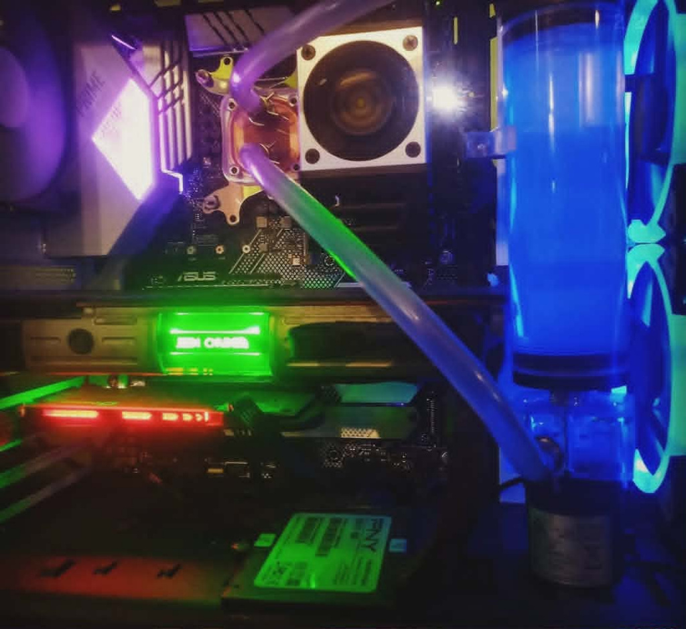

## Project: Barder King - Free Real Estate PC (2020)

**Goal:** Use free parts to set up a gaming PC for the roomate.

### System Specs

| Component | Part |
| :--- | :--- |
| **Case** | Thermaltake H200 TG SNOW RGB |
| **Motherboard** | ASUS PRIME B450 PLUS |
| **CPU** | Ryzen 3600 |
| **RAM** | 16GB (2 x 8GB) DDR4 3000 |
| **GPU** | ZOTAC GTX 1650 OC 4GB |
| **Storage** | 1tb WD Blue|

### Build Notes

A friends family member wanted to trade an old box of computer parts for me to build them a PC. This was a very generious offer so I paid it forward by building this PC for that roomate using the extra parts.

Nothing incredibly exciting about this build, I used the CPU and motherboard out of her box of parts, She had a fairly nice Thermaltake case that was a breeze to work in.

I ended up stealing the old 1650 I used in the Parts Bin machine and buying a new harddrive which is rare for my builds. I threw in a couple of HDDs I ripped out of office computers and mostly focused on cable management.

One of the more straight forward and simple builds in the list.

I actually got this PC back this year after they used it for the last 6 years, I guess they dropped a big gulp in it and decided to upgrade. 

