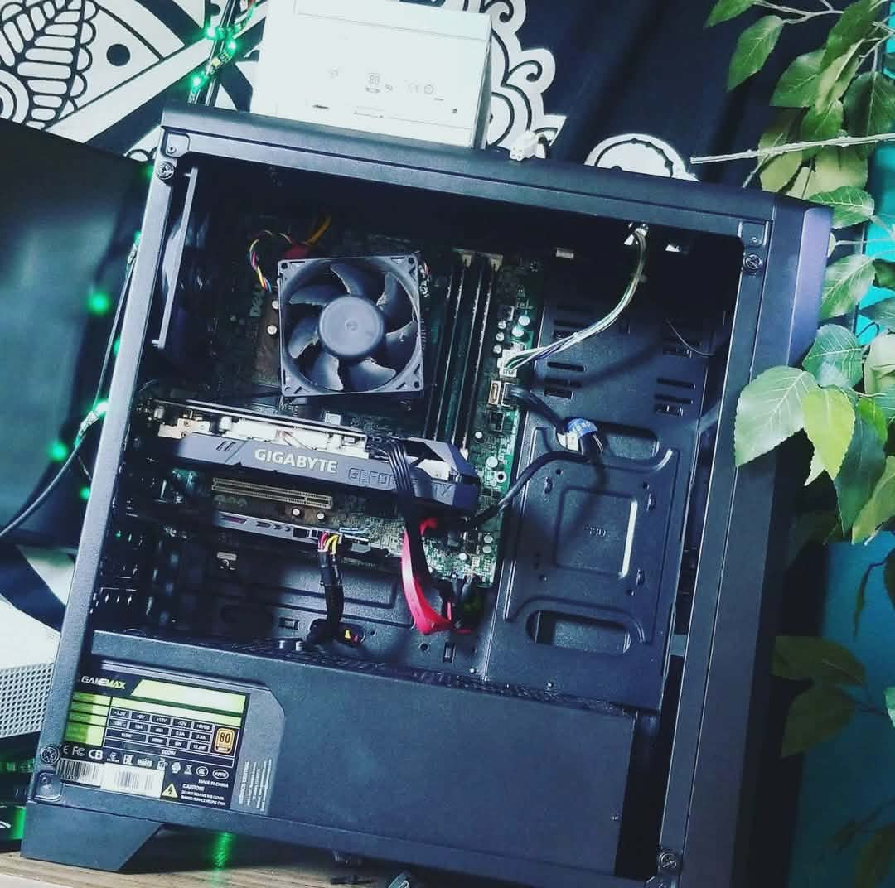

## Project: Parts Bin - The Firehazard PC (2020)

**Goal:** Build an ultra-budget gaming PC during the height of pandemic-era hardware shortages.

### System Specs

| Component | Part |
| :--- | :--- |
| **Case** | Aerocool Cylon (Salvaged with broken glass) |
| **Motherboard** | Dell Optiplex 9020 (Proprietary) |
| **CPU** | Intel i5 4670 |
| **RAM** | 16GB (4 x 4GB DDR3) |
| **GPU** | Nvidia GTX 1650 Super |
| **Storage** | 1TB SSHD + 2x 1TB HDD |
| **Cooler** | Stock cooler with case fan zip-tied for BIOS bypass |
| **PSU** | Dual Setup: Stock Dell PSU + Gamemax 600W |

### Build Notes

* **Salvage Operations:** Needed a temp PC setup due to the death of my main rig. Computer parts were scarce due to the pandemic, but I was able to salvage a case with a broken glass panel for free and foolishly swapped the motherboard from my 9020 Optiplex into the box.

* **Proprietary Power Workaround:** It became pretty apparent after installing everything that the power supply I bought would not interface with the proprietary connections on the motherboard, so sacrifices needed to be made. I got "creative" and ended up backpacking the original white Dell PSU on top of the machine and using them both to power the system.

* **The Parts Bin Special:** I couldn't seem to find an affordable SSD to run the OS, so I opted to use an SSHD I had in the parts bin that came out of my college laptop. Luckily I had a GPU I could use for the project; I sold my old 1080 right before the pandemic hit but had a 1650 Super I bought previously.

* **BIOS Bypass:** Ended up zip-tying an extra case fan to the stock cooler due to an error that complained on every bootup. I figured... more better? Probably not though lol, but it provided the necessary RPM signal to get past the POST error.

### Usage and Outcome

This was really the PC that transformed me from console to PC gaming. I had nicer setups previously, but without a console at the time, she really pulled through for me. 

I have fond memories of playing Resident Evil 2 Remake with a friend, showing off just how cheaply it could be done when you are willing to get your hands dirty with the hardware.

