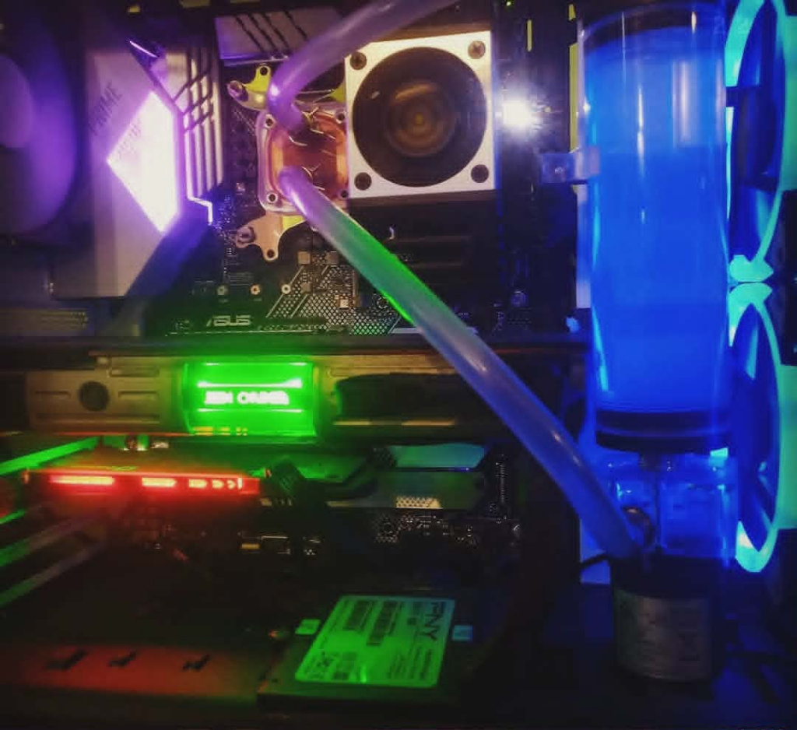

## Project: Parts Bin - The Redemption 2.0 PC (2021)

**Goal:** Revive the Redemption PC.

### System Specs

| Component | Part |
| :--- | :--- |
| **Case** | Open Air Design (NZXT S340 - Destroyed) |
| **Motherboard** | ASUS PRIME Z390 |
| **CPU** | Intel i9-9900KF |
| **RAM** | V-Color 32GB (4 x 8GB) DDR4 2666 |
| **GPU** | Nvidia Titan Xp (Star Wars Edition) |
| **Storage** | 500GB Plextor M8Pe PCIe drive + 4TB HDD |

### Build Notes

The original Redemption PC suffered a violent death. Long story short, sometimes things don't work out the way you hope. The motherboard was shot with severe damage to the pins, the cooler was ripped off and damaged, the CPU lid was missing, and there was water all over the damn thing.

It was a good excuse to upgrade. I bought an i9-9900KF combo from Micro Center for $500. Since most of my original case was dinged or bent, I pivoted and went with an open-air design.

### Cooling and GPU Hunt

I started with a cheapo Amazon custom liquid cooling kit, though I eventually replaced the waterblock with a Corsair one later. 

Due to the "second great GPU shortage," I once again was subjected to the hunting grounds. I ended up with a Star Wars Galactic Empire Edition Titan Xp because some old things are secretly timeless. It cost me $600 "pandemic dollars."

### Performance and Stability

Everything else from the previous build pretty much came over. I still have the 4000MHz RAM from before, but I was sick of dealing with it, so I just bought the cheapest RAM Amazon had to offer and went on my way.

Sadly, the i9 really had no overclock potential whatsoever; it seems almost unstable even at its turbo speeds. It was a disappointment in that regard, but it's extremely functional, and I am still running this CPU today.

