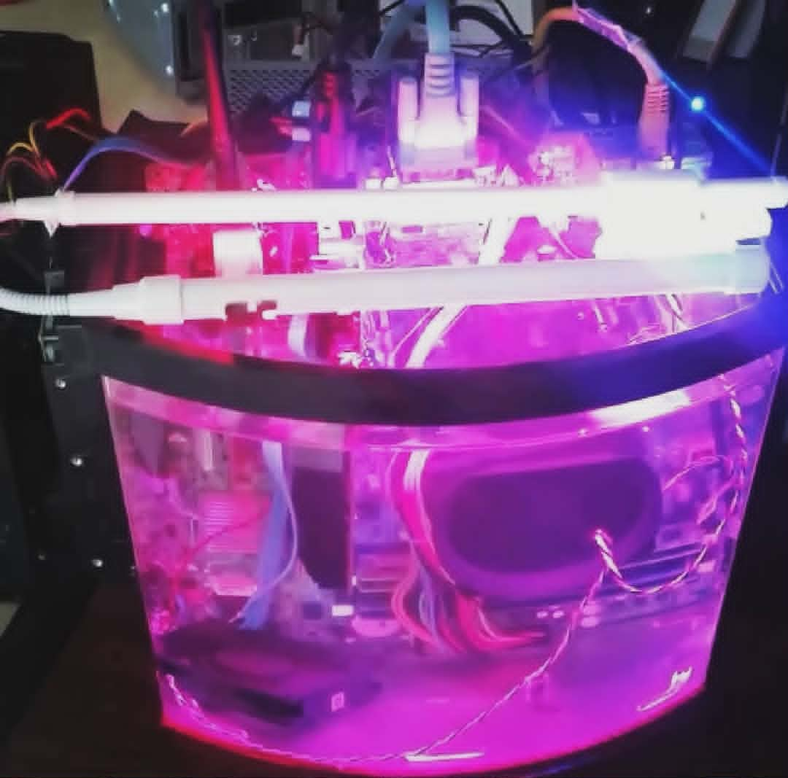

## Project: Submerged Serial - The 2.5G Mineral Oil PC (2018)

**Goal:** Create an underwater PC for network labbing and experimentation.

### System Specs

| Component | Part |
| :--- | :--- |
| **Tank** | Aqueon LED Minibow Aquarium kit 2.5 gallon |
| **Motherboard** | Dell Optiplex 990 SFF (Salvaged) |
| **CPU** | Intel i5 2400 |
| **RAM** | 16GB (4 x 4GB DDR3) |
| **GPU** | AMD Radeon R5 240 |
| **Hard Drive** | Toshiba 1TB |
| **Coolant** | Food grade mineral oil |

### Build Notes

* **Form Factor Struggles:** Initially intended to use an Inspiron 3647 I had laying around to do this build but the motherboard had no chance of fitting. Ended up salvaging the 990 SFF for this project during some CompTIA A+ labs with friends.

* **The "Backpack" PSU:** I was able to screw the power supply onto a simple bracket I fabbed and hang it on the back edge of the tank as a backpack.

* **I/O & Mounting:** The motherboard was test-fitted so the ports were just barely out of the fill line. I ended up putting an R5 240 I robbed from a decom machine and a network card in there for mostly aesthetic purposes.

* **The "Wandering" Fans:** I decided to leave the case fans in the tank to help move the oil around, but they did wander a bit after filling.

* **Storage:** The hard drive was stuck to the side of the tank using 3M mounting tape.

* **Legacy Support:** I used this computer regularly due to the serial port on the yee ole network homelab v1. 

### The End of an Era

I filled the machine with food grade mineral oil, though initially the goal was RODI water. 

Surprisingly it never overheated the oil; if I left it at idle it was fine, and I never had any long running tasks ongoing other than the occasional Doom session. 

It unceremoniously perished during an earthquake when a sword mounted on the wall fell from an unimaginable distance and managed to crack the glass.

